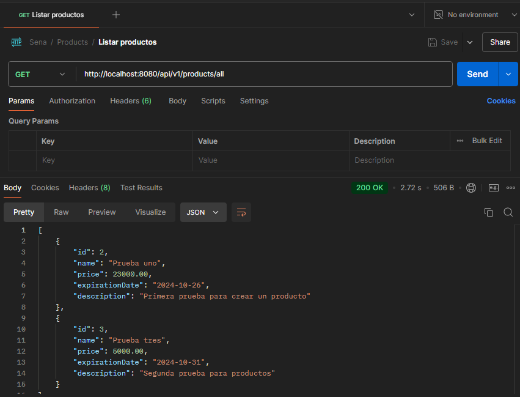

# API PRODUCTO
## API CRUD de productos con Java JDK 21 Sprign Boot 3.3.4, crear uan Base de datos nombre dbpharmanet

### Listar productos

### Eliminar un producto que no existe por id 

### Eliminar un producto existente por id

### Agregar producto

### En campos nulos o blancos

### Actualizar un producto de existente

